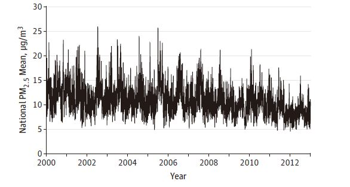

# Background

- US National Ambient Air Quality Standards (NAAQS) for 
  fine particulate matter (PM$_{2.5}$) and ozone every are reviewed every
  5 years.
- 2012  annual and 24-hour NAQQS for PM$_{2.5}$ is 35 $\mu$g/m$^{3}$ and 12 $\mu$g/m$^{3}$.
- 2012 8-hour NAQQS for ozone is 70 ppb, no annual standard
- Studies in large metropolitan areas have provided evidence for short-term   exposure to PM$_{2.5}$ and ozone were associated with mortality.

# Aim and Objectives
- Aim to study the effect of short-term exposure below daily NAQQS, and in rural and unmonitored areas.
- Aim to study the effect on sensitive subgoups such as those with low       socio-economic status.

# Data source and participants
- Participants: all deaths among all Medicare benficiaries from 2000 to       2012.
- Outcome: all-cause mortality. Individuals with validated date of death     between January 1, 2020 and December 31, 2012 were included.
- Exposure: daily 24-hour PM$_{2.5}$, 8-hour maximum ozone, and daily air     and dew point temperatures. Monitored data from the EPA, satellite-based   measurements, and other data sets. Neural networks were used to predict    24-hour PM2.5 and 8-hour maximum ozone concentrations.
- Warm season: April 1 to September 30, which is the specific time window    to examine the association between ozone and mortality

# Case-cross over design
- Usage: the design has been widely used to study the association between c   short-term air pollution exposure and the risk of an acute adverse health   event.
- Main idea: for each individual case, exposure just before the event is     compared with exposure at other control ("referent") times.
- Statistical method: Conditional logistic regression.  
  
In this study  
- Case day: date of the death.
- Control days: on the same day of the week as the case day to control for   potential confounding effect by day of week; before and after the case     day to control for time trend; only in the same month as the case day to   control for seasonal and subseasonal.
- Time window: the death day and the day before death.

# Statistical analysis

- Regression model included both pollutants as main effects and natural      splines of air and dew point temperatures with 3 df to control for         residual confounding by weather. 
- Relative risk increase (RRI) was defined as RR − 1.
- The absolute risk difference (ARD) of all-cause mortality associated with   air pollution was defined as $\alpha \times (RR - 1)/RR$, where $\alpha$ denotes the baseline daily mortality   rate.

# Baseline characteristics

# PM$_{2.5}$ times series

# Ozone time series

# Regression result

# Subgroup analysis

# p-value 
two sample test
$Z = \frac{RR_{male} - RR_{female}}{\sqrt{(se(RR_{male})^2 - se(RR_{female})^2)}}$

# Dose-response

# Conclusions

In the US Medicare population from 2000 to 2012, short-term exposures to PM$_{2.5}$ and warm-season ozone were significantly associated with increased risk of mortality. This risk occurred at levels below current national air quality standards, suggesting that these standards may need to be reevaluated.

# 
Thanks!
