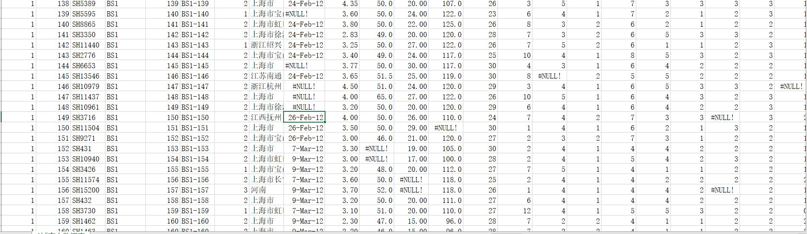
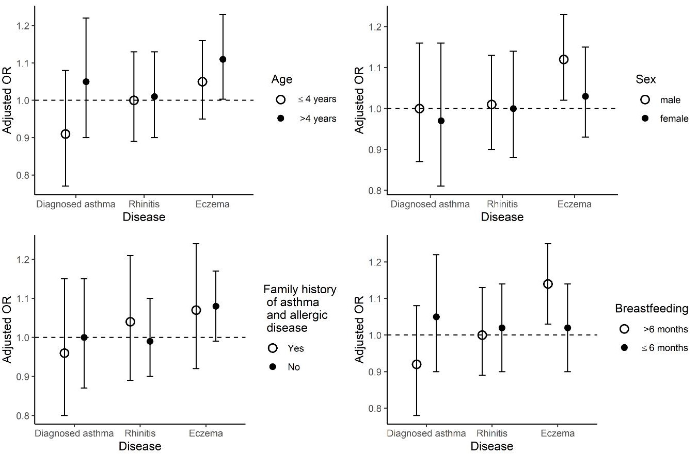
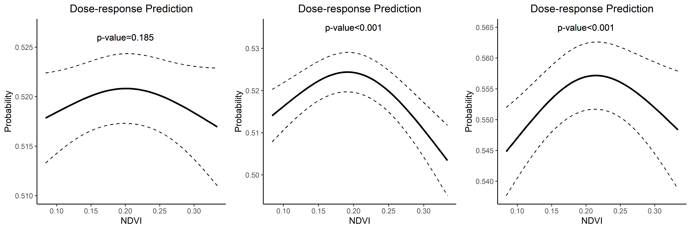

## Background

China, Children, Homes and Health (CCHH) project 

 - Conducted during November 2010 to April 2012 in 10 Chinese cities.
 - Participants were pre-school children aged 1-8 yrs.
 - Questions were answered by their parents or guardians.
 - Only six cities questionnaire contains the kintergarden address.
 - No sampling weights in the dataset.
 - We used data from 2010 to 2011

| City     | Survey Year| Used Year| Participants |
|--------- | ---------- |--------|------|
|Changshang| 2011       |2011    |2,779 |
|Chongqing | 2010       |2010    |3,424 |
|Shanghai  | 2011, 2012 (January - April) | 2011| 7,019|
|Nanjing   | 2011       |2011    |2,443|
|Taiyuan   | 2011       |2011    |2,084|
|Urumqi    | 2011       |2011    |1,491|

## Background

- However, the dataset is messy.
- For the children health section, the questionnaire was designed in accordance to the protocols of International Study of Asthma and Allergies in Childhood (ISAAC). 
- We studied the greenness's health effect on childhood allergic diseases and symptoms.

## Variables

- Allergic diseases or symptoms
1. Diagnosed Asthma: Has a doctor ever diagnosed asthma in your child?
2. Allergic rhinitis: Has a doctor ever diagnosed allergic rhinitis/hay fever in your kid?  
***or***   
In the past 12 months, has your kid had a problem with sneezing or a runny or block or itchy, watery eyes when he/she was exposed to animal furs, plant, or pollens?
3. Current eczema: Has your child had eczema in the past 12 months

## Exposures

- We got the enviroment information based on the ***kintergardens'*** address
1. Greenness (NDVI): Half-Monthly data
2. PM2.5  : Monthly data
3. Temperature: Monthly data

- We used the annual average level of enviroment information corresponding to the date of questionnaire completion of each child, either in 2010 or 2011

## Exposures

| Variable         | Chongqing (N=53) | Changsha (N=35) | Nanjing (N=21) | Shanghai (N=61) | Taiyuan (N=10) | Urumqi (N=14) |
|------------------|------------------|-----------------|----------------|-----------------|----------------|---------------|
| NDVI             | 0.19   | 0.18     | 0.18    | 0.20     | 0.19    | 0.18  |
| PM2.5         | 83.68  | 95.27    | 78.63   | 64.90    | 94.33   | 82.84 |
| T &deg; C     | 18.33  | 17.87    | 15.86   | 16.98    | 10.46   | 6.76  |

 The estimated annual average levels of environment inforamtion in each city 

Notes: N represents the number of kintergardens in the city

## Results

<table class=" lightable-classic" style='font-size: 18px; font-family: "Arial Narrow", "Source Sans Pro", sans-serif; width: auto !important; margin-left: auto; margin-right: auto;'>
<caption style="font-size: initial !important;">The odds ratios of childhood allergic diseases and symptoms for 0.1
             unit change in NDVI, using generalized mixed model</caption>
 <thead>
<tr>
<th style="empty-cells: hide;" colspan="1"></th>
<th style="padding-bottom:0; padding-left:3px;padding-right:3px;text-align: center; " colspan="2">
Overall
</th>
<th style="padding-bottom:0; padding-left:3px;padding-right:3px;text-align: center; " colspan="2">
Northern China
</th>
<th style="padding-bottom:0; padding-left:3px;padding-right:3px;text-align: center; " colspan="2">
Southern China
</th>
</tr>
  <tr>
   <th style="text-align:left;">   </th>
   <th style="text-align:center;"> Ajusted OR </th>
   <th style="text-align:center;"> 95%CI </th>
   <th style="text-align:center;"> Ajusted OR </th>
   <th style="text-align:center;"> 95%CI </th>
   <th style="text-align:center;"> Ajusted OR </th>
   <th style="text-align:center;"> 95%CI </th>
  </tr>
 </thead>
<tbody>
  <tr>
   <td style="text-align:left;"> Diagnosed Asthma </td>
   <td style="text-align:center;"> 0.99 </td>
   <td style="text-align:center;"> 0.89-1.11 </td>
   <td style="text-align:center;"> 0.64 </td>
   <td style="text-align:center;"> 0.44-0.94 </td>
   <td style="text-align:center;"> 1.03 </td>
   <td style="text-align:center;"> 0.92-1.16 </td>
  </tr>
  <tr>
   <td style="text-align:left;"> Allergic Rhinitis </td>
   <td style="text-align:center;"> 1.01 </td>
   <td style="text-align:center;"> 0.93-1.10 </td>
   <td style="text-align:center;"> 0.91 </td>
   <td style="text-align:center;"> 0.71-1.18 </td>
   <td style="text-align:center;"> 1.02 </td>
   <td style="text-align:center;"> 0.93-1.11 </td>
  </tr>
  <tr>
   <td style="text-align:left;"> Current Eczema </td>
   <td style="text-align:center;"> 1.08 </td>
   <td style="text-align:center;"> 1.01-1.16 </td>
   <td style="text-align:center;"> 0.97 </td>
   <td style="text-align:center;"> 0.80-1.17 </td>
   <td style="text-align:center;"> 1.09 </td>
   <td style="text-align:center;"> 1.01-1.17 </td>
  </tr>
</tbody>
</table>

Adjusted for standardized PM2.5 concentration, standardized temperature, age, gender, breastfeeding, family allergic history residence location, maternal smoking during pregnancy, dampness problem and interior decoration as fixed effect and city as random effect.

## Subgroup Analysis

## Non-linear relationship
  

 Notes: Generalized additive model 

### Thanks 

